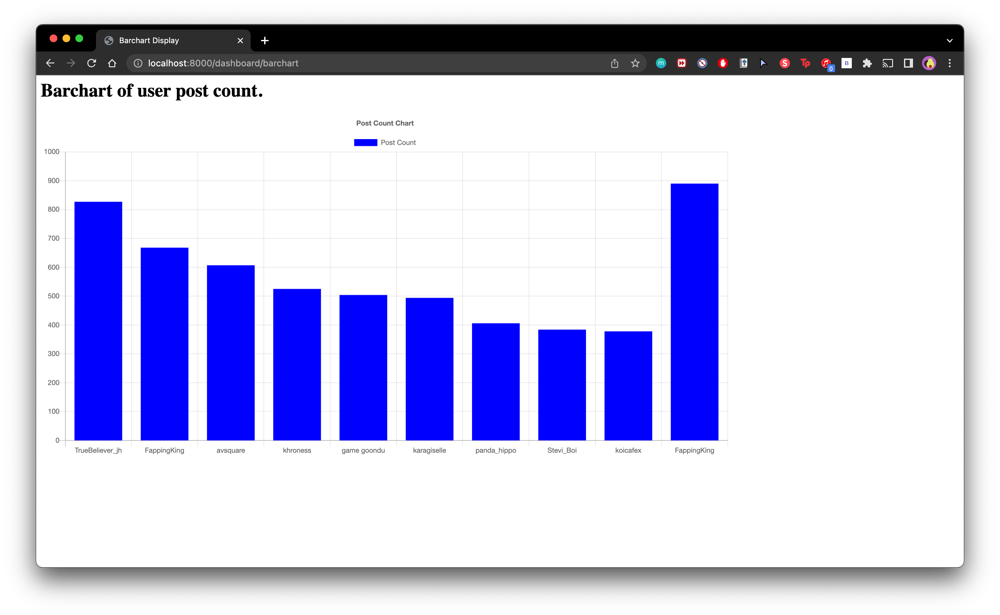

# Huiqi's IS459 Assignment 4

## About
In this repository, we'll be using Scrapy to crawl the threads & posts from the HardwareZone PC Gaming Forum. The scraped data will then be passed over to Kafka as a Kafka message, in the ```scrapy-output``` topic. Afterwards, we will dump the incoming message stream into the ```spark-output``` message stream and pass them over to a Django backend to visualize the top 10 authors on a Django web application.
<br><br>

## Results Screenshot (For Grading)



## Setting up your environment
Ensure that you already have the following installed before you begin:
> 1) Python 3 or later
> 2) Kafka, Spark, Scrapy, Django
<br><br>

## Starting up Kafka & Consuming Kafka Messages
Step 1: Open terminal and head over to your Kafka directory titled ```kafka_2.12-2.8.0```. If you are running on Mac, run the following command:
```
cd /usr/local/Cellar/kafka_2.12-2.8.0
```

Step 2: Start Zookeeper by running the following command: 
```
bin/zookeeper-server-start.sh config/zookeeper.properties
```

Step 3: Open up another tab in terminal and repeat step 1. Afterwards, start up the Kafka environment by running the following command:

```
bin/kafka-server-start.sh config/server.properties
```

Step 4: Repeat Step 1 in another terminal tab. Start consuming messages that were output by the Scrapy crawling process by running the following command: 
```
bin/kafka-console-consumer.sh --topic spark-output --from-beginning --bootstrap-server localhost:9092
```

Once this is done, view the next section on how to crawl data via Scrapy and output them into this Kafka topic. <br><br>

## Initializing & Running Scrapy
Ensure that you are in the directory of ```AS4/django/hwz_monitor/tasks/hardwarezone```. To start crawling the HardwareZone PC Gaming Forum, run the following command:
```
scrapy crawl hardwarezone
```
To view output of the crawling process, refer to the previous section Step 4 on how you can consume the Kafka messages. <br><br>

## Running Python files for Spark Streaming & output to Kafka Topic

The results being output to the console consist of top 10 authors within a window that lies within the current timestamp.

1) Get Top 10 Authors within 2 minute window, run the following command:
```
spark-submit --packages org.apache.spark:spark-sql-kafka-0-10_2.12:3.1.2 getTopAuthors.py
```
Important Note: Timeout set here for Kafka topic consumer is 60000ms. Results will only be available for display on barchart only after a few minutes. 

## Django Web Application 
1. To start the Django server, run the following command: 
```python manage.py runserver```
2. Endpoint for incoming data is at ```localhost:8000/dashboard/kafka```
3. To view barchart, head to: ```localhost:8000/dashboard/barchart```


